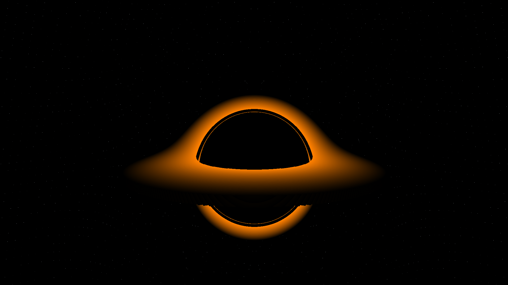

# Black Hole Simulation

This is a real-time OpenGL simulation of a black hole with an accretion disk and gravitational lensing effects.



## Features

- Real-time rendering of a black hole event horizon
- Accretion disk visualization
- Gravitational lensing on background stars
- Interactive camera controls

## Requirements

- OpenGL 3.3+
- GLFW
- GLEW

## Building

Compile with g++ or similar:

```
g++ main.cpp -o blackhole -lGL -lGLEW -lglfw
```

## Running

```
./blackhole
```

## Controls

- W/S: Move forward/backward
- A/D: Strafe left/right
- Arrow keys: Look around
- ESC: Exit